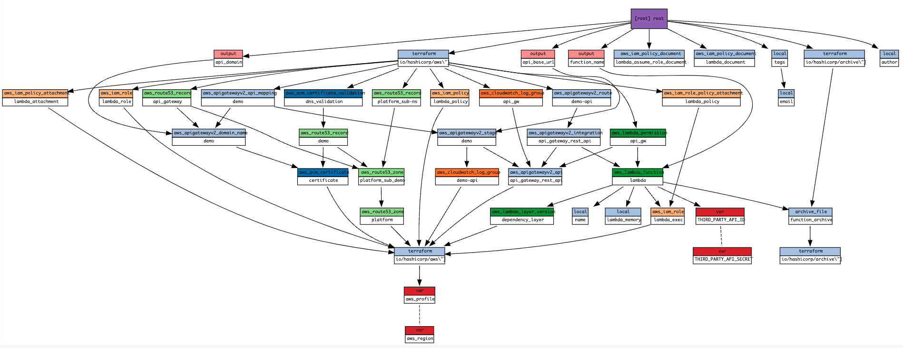

[](https://github.com/eunchurn/terraform-typescript-lambda-apigateway/actions/workflows/tfsec.yml)

# Terraform TypeScript Lambda & API Gateway Infrastructure

TypeScript Lambda handler deployment and API Gateway v2 public endpoint 



- [Show Infra Graph](https://eunchurn.github.io/terraform-typescript-lambda-apigateway/)
- [Blog post](https://www.eunchurn.com/blog/development/2022-10-23-tWIL)

## Prerequisite

- NodeJS 16
- [Terraform](https://learn.hashicorp.com/tutorials/terraform/install-cli)

### Terraform install for Apple Silicon

[Reference](https://discuss.hashicorp.com/t/template-v2-2-0-does-not-have-a-package-available-mac-m1/35099/4)

- 1. Remove any existing Terraform binary (/usr/bin/terraform and/or /usr/local/bin/terraform)
- 2. Install [m1-terraform-provider-helper](https://github.com/kreuzwerker/m1-terraform-provider-helper)
  - 2.1. `brew install kreuzwerker/taps/m1-terraform-provider-helper`
- 3. Install Terraform
  - 3.1. `brew tap hashicorp/tap`
  - 3.2. `brew install hashicorp/tap/terraform`
- 4. Install the hashicorp/template version v2.2.0
  - 4.1. `m1-terraform-provider-helper activate`
  - 4.2. `m1-terraform-provider-helper install hashicorp/template -v v2.2.0`

```
➜  ~ terraform --version
Terraform v1.3.1
on darwin_arm64
+ provider registry.terraform.io/hashicorp/aws v4.33.0
+ provider registry.terraform.io/hashicorp/random v3.4.3
+ provider registry.terraform.io/hashicorp/template v2.2.0
```
### Project

- Change your Lambda function name `terraform/locals.tf`
  - `name = "{your app name}"`
- Change your API Gateway info `terraform/apiGateway.tf`
  - `aws_route53_zone`
  - `aws_route53_zone` sub
  - `aws_acm_certificate`: domain_name, subject_alternative_names
  - `aws_apigatewayv2_domain_name`: domain_name

## Usage

- `yarn tf:init`
- `yarn tf:plan`
- `yarn tf:apply`

### Destory

- `yarn destroy:all`

### Update All

- `yarn update:all`

- Check outputs
